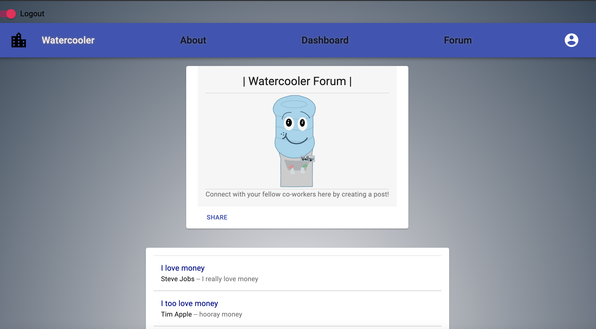

# Watercooler

## Table of Contents

- [Description](#Description)
- [Installation Instruction](#Installation-Instructions)
- [Usage Information](#Usage-Information)
- [Contributions](#Contributions)
- [Testing](#Testing)
- [Questions?](#Questions?)

## Description

This is a MERN app that utilizes Firebase and Material UI. The purpose of this app is to hold a space for employees to talk freely about their workplace experiences in a forum that isn't affiliated offically with their employer. This can be great for voicing concerns, offering advice, and also building comradery in a world where more and more people are working from home.

## Installation Instructions

You can download all the necessary files into VSCode, run an npm i, and run "npm run start"; or you can simply use the deployed Heroku link.

Sign up and fill out your workplace info; you'll then be assigned to forums for your company and specific location. Make posts and view posts from others.

## Usage Information

This app was created using React.

## Contributions

This app was built by Carl K., Grant J., Elijah F., and Kylie S.

## Testing

N/A

## Questions?

Contact the authors for further inquiries!
 
Deployed Heroku link: https://sheltered-cliffs-91068.herokuapp.com/
 
Github links:
Project repo - https://github.com/Carl-33/Watercooler

Carl's Github - https://github.com/Carl-33
Grant's Github - https://github.com/Josly025
Elijah's Github - https://github.com/ElijahFlanders96
Kylie's Github - https://github.com/kyliemegan24
